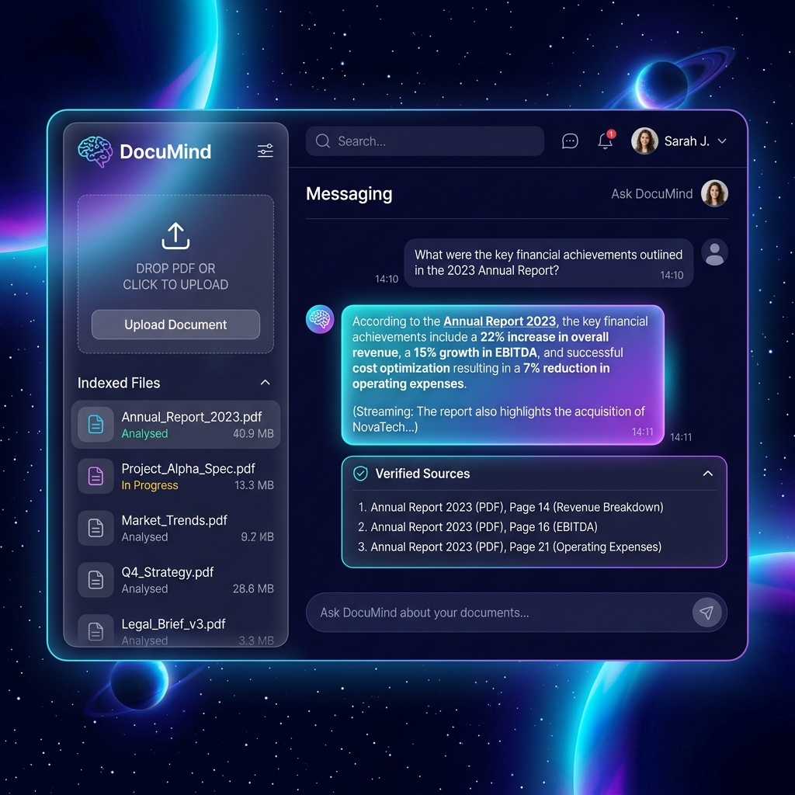

# DocuMind — AI-Powered PDF Chatbot & RAG System

DocuMind is an AI-powered system designed to process, index, and query PDF documents using Retrieval-Augmented Generation (RAG). It serves a **premium, glassmorphic Single Page Application (SPA) frontend** directly from its root, offering a beautiful user interface to upload files, index contexts, and chat with citation-backed streaming answers.

By combining dense vector search (FAISS) and sparse keyword search (BM25), DocuMind provides highly accurate, grounding-backed responses while eliminating LLM hallucinations.



---

## Features

- 💎 **Premium Interactive UI**: Stunning dark-mode layout with radial space glows, responsive file drag-and-drop zone, live indexing loaders, and interactive chat console.
- ⚡ **Real-Time Token Streaming**: Streams tokens word-by-word into clean user-bot chat bubbles using a custom javascript event parser.
- 📌 **Collapsible Citation Cards**: Dynamically extracts page numbers, source files, and grounding paragraph text in a clickable accordian tray.
- 🧠 **Hybrid Retrieval Ensemble**: Leverages reciprocal rank fusion (RRF) combining FAISS (dense embeddings via OpenAI) and BM25 (sparse keyword retrieval) for optimal accuracy.
- 🔍 **FlashRank Reranking**: Integrates a lightweight cross-encoder reranker to prioritize the most relevant document chunks.
- 📂 **Local Ingestion & Persistence**: Indexes are saved to local pkl/index stores automatically, keeping your knowledge base safe across restarts.

---

## Tech Stack

- **Frontend**: Vanilla HTML5, CSS3 (Glassmorphism, custom animations), Lucide Icons
- **Backend**: FastAPI (Python 3.13)
- **RAG Engine**: LangChain, LangChain-Classic, LangChain-OpenAI
- **Vector Database**: FAISS (Facebook AI Similarity Search)
- **Sparse Retrieval**: `rank_bm25`
- **Reranker**: FlashRank
- **Embeddings**: OpenAI `text-embedding-3-small`
- **LLM**: OpenAI `gpt-4o-mini`
- **Document Parsing**: `pypdf` (fast digital reading) & `unstructured[pdf]` (hi-res OCR fallback)

---

## Getting Started

### Prerequisites

- Python 3.13 or Docker Desktop installed
- An [OpenAI API Key](https://platform.openai.com/)

---

### Configuration (Environment Variables)

Rename `.env.example` to `.env` in the root directory and add your OpenAI credentials:
```bash
# OpenAI API Key
OPENAI_API_KEY=sk-proj-your_key_here

# App Settings
DEBUG=True
HOST=0.0.0.0
PORT=8000
```

---

### Method A: Local Setup (Recommended)

Since the project uses PDF processing packages, running it in a local virtual environment is highly recommended on Windows for speed and stability.

1. **Create and Activate a Virtual Environment:**
   ```powershell
   python -m venv .venv
   .venv\Scripts\Activate.ps1
   ```

2. **Install Dependencies:**
   ```bash
   pip install -r requirements.txt
   ```

3. **Start the FastAPI Server:**
   ```bash
   python -m uvicorn app.main:app --host 127.0.0.1 --port 8000 --reload
   ```

4. **Access the Application:**
   - Homepage: [http://127.0.0.1:8000/](http://127.0.0.1:8000/)
   - Swagger API Docs: [http://127.0.0.1:8000/docs](http://127.0.0.1:8000/docs)

---

### Method B: Docker Containerized Setup

If you prefer containerized runtimes and have a working Docker environment:

1. **Build and Spin Up the Container:**
   ```bash
   docker compose up --build -d
   ```

2. **Access the Application:**
   - [http://localhost:8000/](http://localhost:8000/)

---

## API Usage Reference

If building external integrations, you can interact with the RAG API programmatically:

### 1. Upload & Index Document
* **Endpoint**: `POST /api/upload`
* **Content-Type**: `multipart/form-data`
* **Response**:
  ```json
  {
    "filename": "document.pdf",
    "message": "Successfully processed and indexed 15 chunks from the document."
  }
  ```

### 2. Query & Stream Answers
* **Endpoint**: `POST /api/query`
* **Request Body**:
  ```json
  {
    "question": "What is the main topic of the uploaded document?"
  }
  ```
* **Response**: Returns a Server-Sent Events (SSE) stream (`text/event-stream`) detailing citations, token chunks, and completion state.
